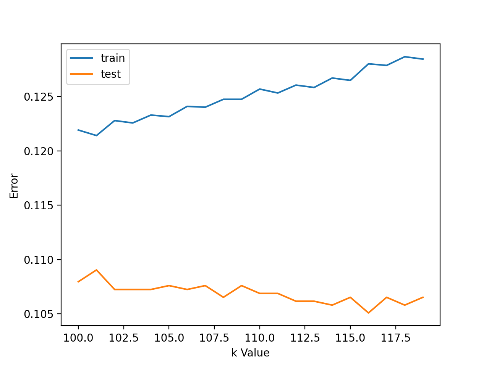

K-Nearest Neighbors (KNN) algorithm assumes that similar data points are close to each other, this means that data points representing patients with conductive hearing conditions are closer to each other, while data points representing normal patients are closer to each other. The algorithm is based on calculating the distance between data points with pre-defined number of neighbors (k).

Choosing the optimal number for k is a tricky task in KNN algorithm. The optimal value of k can be identified when test error stabilizes and is low. To find the optimal value of k, an error curve was plotted, whcih showed that the optimal value of k is 116 for the WBT dataset. With k=116, the test model accuracy is 0.8949 and train model accuracy of 0.872.

Disadvantages of KNN:
-	Choosing the optimal number for k can be tricky, a low value of k could lead to overfitting problems while a high value of k could lead to underfitting.
-	The computing process will become much slower when more data is fed in. This might be an issue in the future if more patient’s data is collected and modelled.

Despite that KNN algorithm is a simple classification model and it has a good accuracy score. For the model trained on WBT data, the optimal value of k is quite large which makes it difficult to interpret the final results. In adiition, the accuracy score of KNN is not as well as other models and computing power could be expensive with more data. Therefore, KNN was not a suitable algorithm for WBT data.
